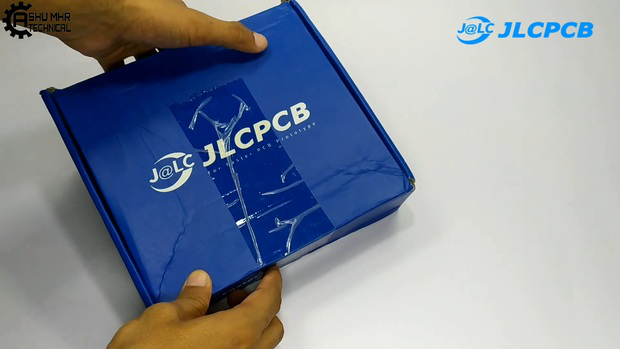

**DIY BMS**

> 
> This is a very interesting yet simple project for controlling ac
> appliances through phone calls. We called this project a DIY BMS.

**Disclaimer:** Be extra careful with this project as it contains
Battery Charging, always check the battery polarity before charging.

> **Supplies:**
>
> All the components required are listed above.

> **Step 1: Get Your PCB Ready!**

**Talking About Electronics**

> After making the circuit diagram I transformed it into a PCB design to
> produce it, to produce the PCB, I have chosen e best PCB supplier and
> the cheapest PCB provider to order my circuit. with the reliable
> platform, all I need to do is some simple clicks to upload the Gerber
> FIle and set some parameters like the PCB thickness color and quantity.
> I've paid just 2 Dollars to get my PCB after FIve days only, what I
> have noticed about is time is the \"out-of-charge **PCB color PCB
> color**\" which means you will pay only 2USD for any PCB color you
> choose.
>
> 

**Related Download Files**

> As you can see in the pictures above the PCB is very well manufactured
> and I've got the same PCB design that we've made for our main board
> and all the labels and logos are there to guide me during the
> soldering steps. You can also download the Gerber �le for this circuit
> from the download link below in case you want to place an order for
> the same circuit design.

**Step 2: Place All the Components on PCB and Solder It Properly.**

> Place All The Components On PCB And Solder It Properly.

**Step 3:**

> After soldering the components to PCB, check voltage output of all 3
> terminals of BMS, it will come around 3.7v, 7.2v & 12v respectively.

**Step 4:**

> **Solder** the wires to PCB as shown in the **images images**.
>
> 
> **Connect other ends** of the same wire to the **dc jack. dc jack.**

> 
> **Solder** all the 4wires of BMS to the
> screw terminal as shown.

**Step 5:**

> **Take** a 5mm LEDs for indicator and place in the custom made box as
> shown Also Solder a LED with resistor for power indication purpose.
>
> Solder and do check all the connections, check polarity of power
> output before placing the cover.
>
> And BOOM! All the connections are done, it's time to cover the body
> with another PVC sheet.

> **Step 6: Final Step**
>
> Connect the 12v adapter to the circuit, your DIY BMS is now ready to
> charge your batteries.
>
> New users will also get some coupons while registering at via this
> blue link.
>
> **Thank you for reading this guide, hopefully**, **this guide provides
> full steps to help you to create your own this guide provides full
> steps to help you to create your own**
>
> **. If you have any questions please post them in the comment section
> below. . If you have any questions please post them in the comment
> section below.**

